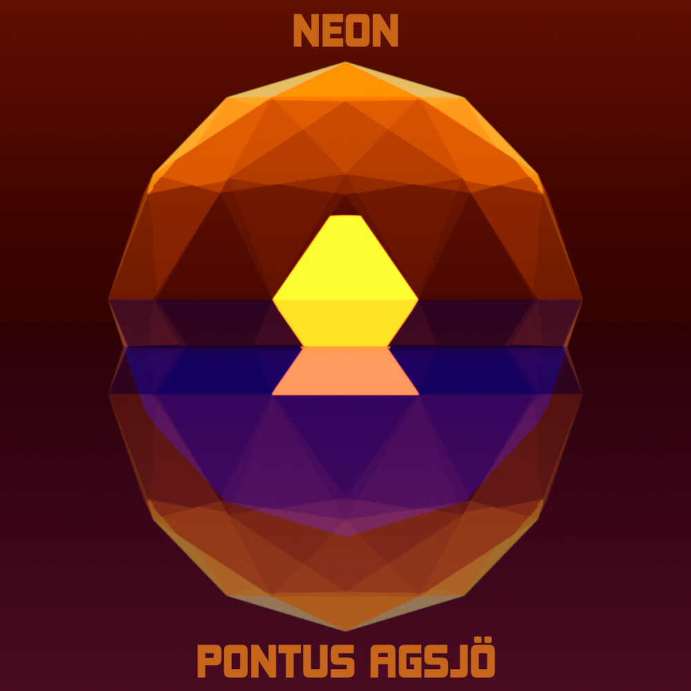

{:width="300"} 
    [Spotify ](https://open.spotify.com/album/0J8jHKH3l0zbUV6FPS5tLd)|[ Apple music ](https://music.apple.com/se/album/neon-single/1724041381)|[ Tidal](https://listen.tidal.com/album/338135159)

NEON är solblekt tekno ursprungligen spelad live på KMH.

Musiken skrevs i Ableton, arrangerades live med Ableton Push och återskapades sedan i Reason där den mixades och mastrades. En salig blandning av synthar, loopar och elbas.

Föreställningen bestod också av grafik, som skapades i Resolume Arena och synkades till musiken.