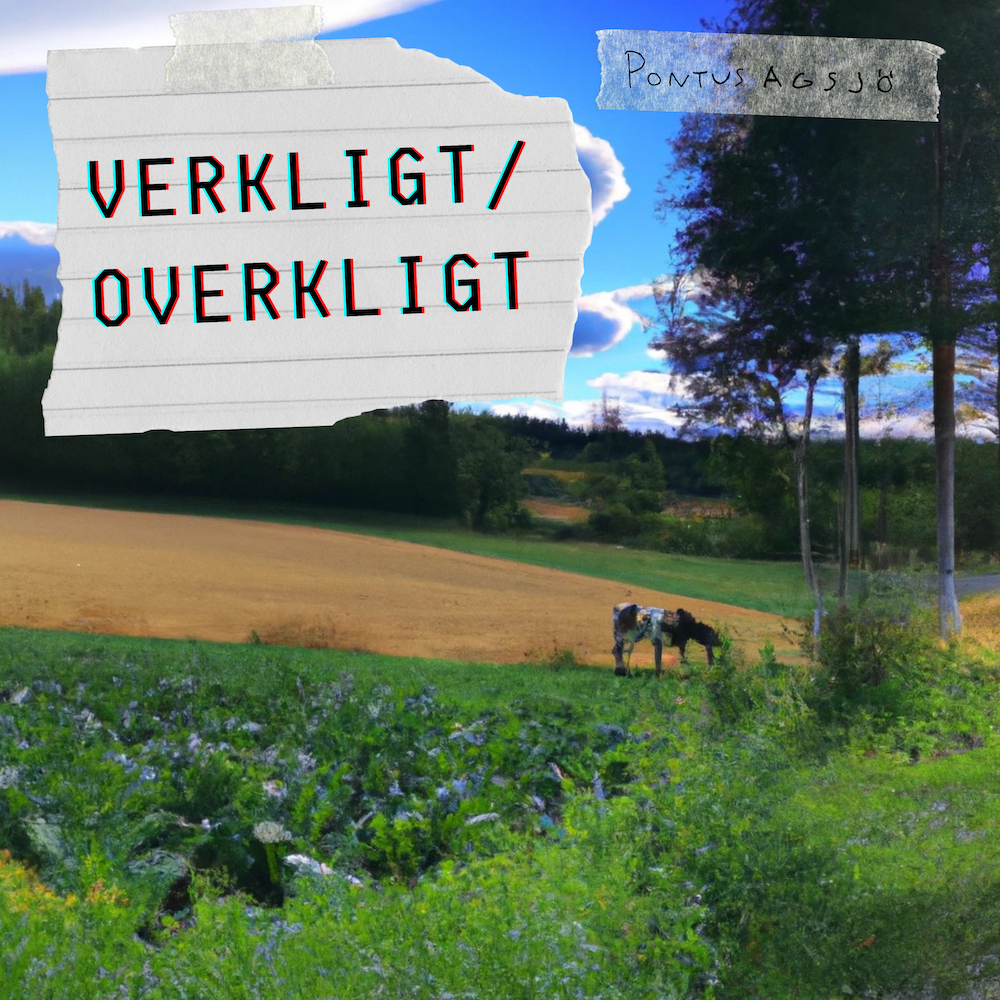

{:width="300"} 
   [Spotify ](https://open.spotify.com/album/3CZOGd4iHoArYD18gGrOqY)|[ Apple music ](https://music.apple.com/se/album/verkligt-overkligt-single/1742829110)|[ Tidal](https://listen.tidal.com/album/359277330)

Verkligt/Overkligt var min examnenskonsert på KMH. Hela setlisten inkluderade förutom min musik två covers, av Tears for Fears *Everybody wants to rule the world* och bob hunds *Det överexponerade gömstället*, men de finns inte med här.

All musik, min egenskrivna och coverlåtarna, skrevs och arrangerades i Reason för backing tracks, gitarr och sång. Ett enmansband med andra ord.

Föreställningen bestod också av grafik, som skapades i Magic Music Visuals och synkades till musiken.